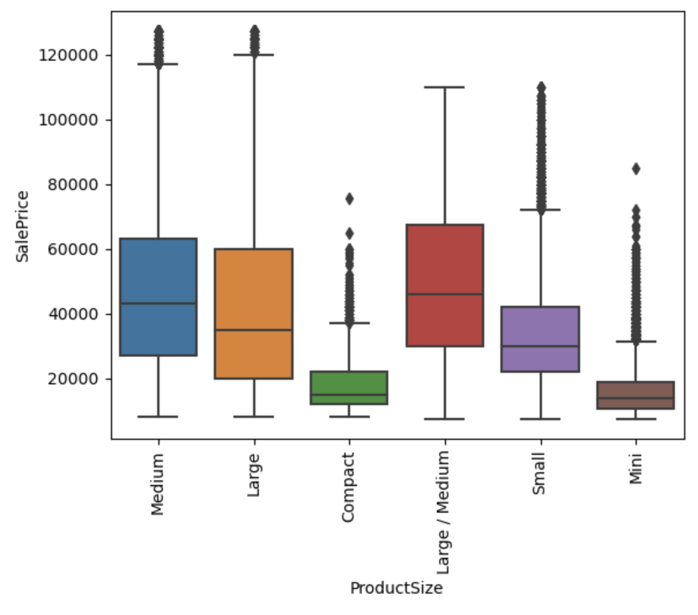

# Blue Book for Bulldozers

## Problem Statement

As Toronto is expanding rapidly, large construction projects are getting approved frequently. Because there are so many concurrent construction projects, the demand for bulldozers has increased dramatically.

Seeing this opportunity, Sam has opened up a bulldozer rental company called Sam's Quality Construction Rentals. Although his company is rapidly growing, it means much of his time is consumed by buying new bulldozers. With so many different features of a given bulldozer, it is difficult to know what a fair price would be for any particular piece of equipment.

George, a regular client of Sam, the owner of Sam's Quality Construction Rentals, has offered to sell him a bulldozer that was made in 1992, has a backhoe, a double grouser, and 20,700 hours of usage on the meter. for $66,000. Is this a good deal?

## Data

To inform these predictions, I am using this [data set from Kaggle](https://www.kaggle.com/competitions/bluebook-for-bulldozers/data), containing 412,698 observations of bulldozer sales at auction.

## Data cleaning

[Notebook linked here](https://github.com/gregmckenzie88/Capstone-2/blob/main/notebooks/data-wrangling.ipynb)

**One-dimensional Time-series Data**

- In order to expose seasonality patterns in the `salesDate` column, I've enriched this data to expand to five other columns, highlighting year, month, `dayOfWeek`, and `dayOfYear`.

**Erroneous `YearMade` Data**

- As, often, the year in which a machine is made will have a substantial impact on the sales price of said machine, I validated this column to discover several entries had been erroneously labeled.
- This was rectified by investigating the year in which the first bulldozer was made, and committing all entries containing a `YearMade` value before this date, and all entries with a `YearMade` value beyond the current year.

**Erroneous `MachineHoursCurrentMeter` Data**

- Some entries had the machine hours at beyond 283 years, which is not possible, given the first bulldozer was made in 1923.
- I set a threshold to that of a machine running eight hours a day for every weekday since 1923, which may be a generous estimate, but is not outside the realm of possibility.

## EDA

[Notebook linked here](https://github.com/gregmckenzie88/Capstone-2/blob/main/notebooks/exploratory-data-analysis.ipynb)

Looking at the target variable, `Saleprice`, outliers were discovered, although none so extreme that they could not be accurate data points.

Upon further investigation, ~5% of the entries were outliers. At this stage, I entertained two paths forward

- Trim the outliers, and elect a parametric regression model

- Keep the outliers, and elect a decision-tree model

Since decision trees are generally robust to outliers, and since the outliers appeared to be plausible, I decided to keep these data points and proceed with a tree-based algorithm.
