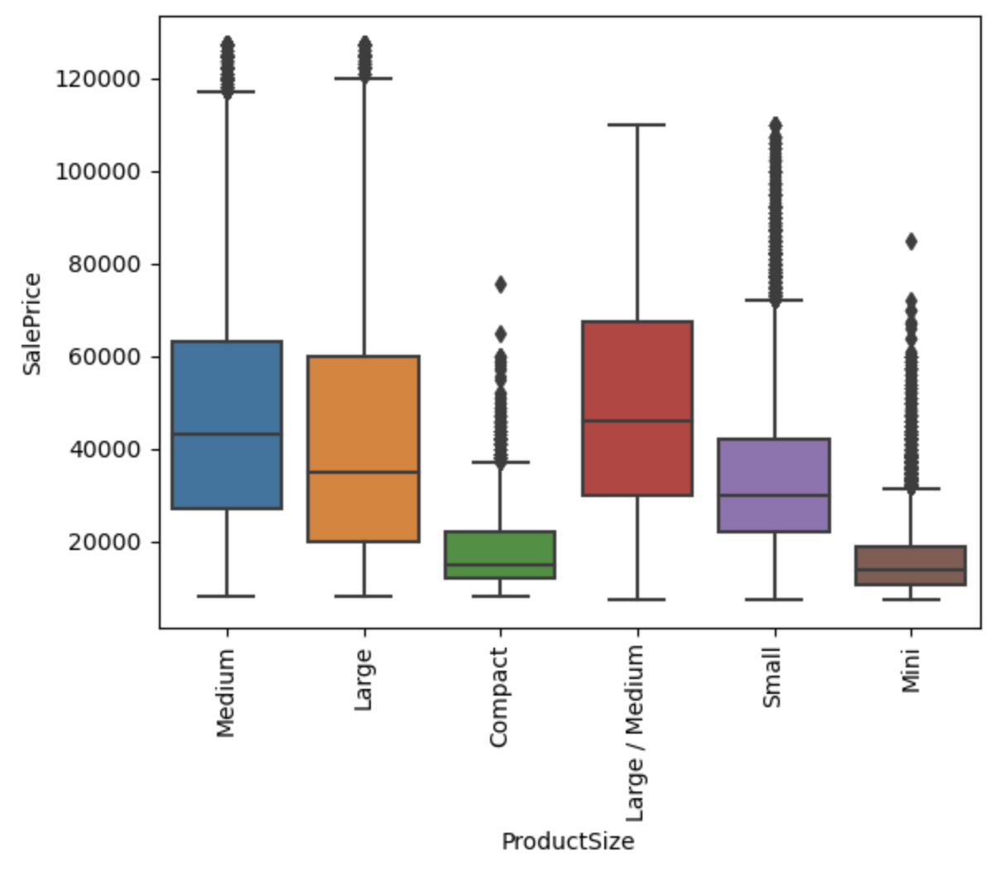

# Blue Book for Bulldozers

## Problem Statement

As Toronto is expanding rapidly, large construction projects are getting approved frequently. Because there are so many concurrent construction projects, the demand for bulldozers has increased dramatically.

Seeing this opportunity, Sam has opened up a bulldozer rental company called Sam's Quality Construction Rentals. Although his company is rapidly growing, it means much of his time is consumed by buying new bulldozers. With so many different features of a given bulldozer, it is difficult to know what a fair price would be for any particular piece of equipment.

George, a regular client of Sam, the owner of Sam's Quality Construction Rentals, has offered to sell him a bulldozer that was made in 1992, has a backhoe, a double grouser, and 20,700 hours of usage on the meter. for $66,000. Is this a good deal?

## Data

To inform these predictions, I am using this [data set from Kaggle](https://www.kaggle.com/competitions/bluebook-for-bulldozers/data), containing 412,698 observations of bulldozer sales at auction.

## Data cleaning

[Notebook linked here](https://github.com/gregmckenzie88/Capstone-2/blob/main/notebooks/data-wrangling.ipynb)

**One-dimensional Time-series Data**

- In order to expose seasonality patterns in the `salesDate` column, I've enriched this data to expand to five other columns, highlighting year, month, `dayOfWeek`, and `dayOfYear`.

**Erroneous `YearMade` Data**

- As, often, the year in which a machine is made will have a substantial impact on the sales price of said machine, I validated this column to discover several entries had been erroneously labeled.
- This was rectified by investigating the year in which the first bulldozer was made, and committing all entries containing a `YearMade` value before this date, and all entries with a `YearMade` value beyond the current year.

**Erroneous `MachineHoursCurrentMeter` Data**

- Some entries had the machine hours at beyond 283 years, which is not possible, given the first bulldozer was made in 1923.
- I set a threshold to that of a machine running eight hours a day for every weekday since 1923, which may be a generous estimate, but is not outside the realm of possibility.

## EDA

[Notebook linked here](https://github.com/gregmckenzie88/Capstone-2/blob/main/notebooks/exploratory-data-analysis.ipynb)

Looking at the target variable, `Saleprice`, outliers were discovered, although none so extreme that they could not be accurate data points.

Upon further investigation, ~5% of the entries were outliers. At this stage, I entertained two paths forward

- Trim the outliers, and elect a parametric regression model

- Keep the outliers, and elect a decision-tree model

Since decision trees are generally robust to outliers, and since the outliers appeared to be plausible, I decided to keep these data points and proceed with a tree-based algorithm.

## Preprocessing and training

[Notebook linked here](https://github.com/gregmckenzie88/Capstone-2/blob/main/notebooks/preprocessing_and_training.ipynb)

Following the decision made during EDA to keep outliers and opt for a decision-tree-based algorithm, I elected the [RandomForestRegressor](https://scikit-learn.org/stable/modules/generated/sklearn.ensemble.RandomForestRegressor.html) from scikit-learn for the initial model, with hyper parameters tuned via [RandomSearchCV](https://scikit-learn.org/stable/modules/generated/sklearn.model_selection.RandomizedSearchCV.html).

The second model was, again, a RandomForestRegressor, this time with hyperparameters tuned via [Bayesian Optimization](https://github.com/bayesian-optimization/BayesianOptimization).

The third was generated via [TPOT pipeline optimizer](http://epistasislab.github.io/tpot/), which returned an [XGBRegressor](https://xgboost.readthedocs.io/en/stable/python/python_api.html#xgboost.XGBRegressor) from exboost.

The results are as follows:

### RandomForestRegressor via RandomSearchCV

| Metric | Training            | Test               |
| ------ | ------------------- | ------------------ |
| MAE    | 2672.3028355081906  | 4481.802841827238  |
| MSE    | 18542561.463251058  | 49735635.77544791  |
| RMLSE  | 0.12762288835433264 | 0.2056094552470327 |
| R2     | 0.9665610075121479  | 0.9096895332049417 |

### RandomForestRegressor via Bayesian Optimization

| Metric | Training            | Test                |
| ------ | ------------------- | ------------------- |
| MAE    | 1639.5948350684127  | 4364.200469238181   |
| MSE    | 6730759.531112538   | 48115859.182510115  |
| RMLSE  | 0.08136847992294637 | 0.20314577004595255 |
| R2     | 0.9878619888711454  | 0.9126307398052228  |

### XGBRegressor

| Metric | Training            | Test               |
| ------ | ------------------- | ------------------ |
| MAE    | 4411.909914273493   | 4727.795474953852  |
| MSE    | 45124750.30912358   | 53141288.268833235 |
| RMLSE  | 0.20274550137074715 | 0.2167150492605207 |
| R2     | 0.9186236384011195  | 0.9035055152141389 |

The winner was RandomForestRegressor model, with hyperparameters tuned via Bayesian Optimization, which returned the most competitive scoring metrics -- not just on our chosen metric, Mean Absoulute Error

## Predictions

As my client was in search of a medium-sized bulldozer, made in the year 1997, in the state of Massachusetts, we were able to predict against these parameters and return a Blue Book sale price prediction of `$59,996.80`

## Future improvements

- As my training set only includes entries up to 2012, it would be nice to refresh this training data to reflect more current prices.

- Because I was tuning this through my personal laptop computer, prolonged hyperparamter tuning was difficult. To improve this model, I would rent virtual machine space to get a more convenient long-term hyperparater tuning.

- Enriching this data with population growth metrics relative to the area in which the Bulldozer was sold my expose new patterns in sales prices

## Acknowledgements

I would like to give a very special thanks to the Springboard Data Science Career Track program, including my incredible mentor Malik, Michelle Jorgensen, and Vinju Vipin.

## Project Organization

---

    ├── LICENSE
    ├── Makefile           <- Makefile with commands like `make data` or `make train`
    ├── README.md          <- The top-level README for developers using this project.
    ├── data
    │   ├── external       <- Data from third party sources.
    │   ├── interim        <- Intermediate data that has been transformed.
    │   ├── processed      <- The final, canonical data sets for modeling.
    │   └── raw            <- The original, immutable data dump.
    │
    ├── docs               <- A default Sphinx project; see sphinx-doc.org for details
    │
    ├── models             <- Trained and serialized models, model predictions, or model summaries
    │
    ├── notebooks          <- Jupyter notebooks. Naming convention is a number (for ordering),
    │                         the creator's initials, and a short `-` delimited description, e.g.
    │                         `1.0-jqp-initial-data-exploration`.
    │
    ├── references         <- Data dictionaries, manuals, and all other explanatory materials.
    │
    ├── reports            <- Generated analysis as HTML, PDF, LaTeX, etc.
    │   └── figures        <- Generated graphics and figures to be used in reporting
    │
    ├── requirements.txt   <- The requirements file for reproducing the analysis environment, e.g.
    │                         generated with `pip freeze > requirements.txt`
    │
    ├── setup.py           <- makes project pip installable (pip install -e .) so src can be imported
    ├── src                <- Source code for use in this project.
    │   ├── __init__.py    <- Makes src a Python module
    │   │
    │   ├── data           <- Scripts to download or generate data
    │   │   └── make_dataset.py
    │   │
    │   ├── features       <- Scripts to turn raw data into features for modeling
    │   │   └── build_features.py
    │   │
    │   ├── models         <- Scripts to train models and then use trained models to make
    │   │   │                 predictions
    │   │   ├── predict_model.py
    │   │   └── train_model.py
    │   │
    │   └── visualization  <- Scripts to create exploratory and results oriented visualizations
    │       └── visualize.py
    │
    └── tox.ini            <- tox file with settings for running tox; see tox.readthedocs.io
